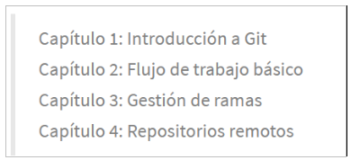

# Ejercicios de creación y actualización de repositorios

## Ejercicio 1

1. Crear un repositorio nuevo con el nombre libro y mostrar su contenido.
2. Configurar Git definiendo el nombre del usuario, el correo electrónico y activar el coloreado de la salida. Mostrar la configuración final.

~~~
>tomas@tomas-VirtualBox:~/Git$ mkdir libro
>tomas@tomas-VirtualBox:~/Git$ cd libro
>tomas@tomas-VirtualBox:~/Git/libro$ git init
>Inicializado repositorio Git vacio en /home/tomas/Git/libro/.git/
>tomas@tomas-VirtualBox:~/Git/libro$ ls -la
total 12
drwxrwxr-x 3 tomas tomas 4096 oct 6 09:40 .
drwxrwxr-x 4 tomas tomas 4096 oct 6 09:39 ..
drwxrwxr-x 7 tomas tomas 4096 oct 6 09:40 .git

>tomas@tomas-VirtualBox:~/Git/libro$ git config --global user.email "tomascastello444@gmail.com"
>tomas@tomas-VirtualBox:~/Git/libro$ git config --global user.name "Tomas"
>tomas@tomas-VirtualBox:~/Git/libro$ git config --list
user.email=tomascastello444@gmail.com
user.name=Tomas
core.repositoryformatversion=0
corefilemode=true
core.bare=false
core.logallrefupdates=true
git config --global color.ui auto
~~~

## Ejercicio 2

1. Comprobar el estado del repositorio.
2. Crear un fichero indice.txt con el siguiente contenido:
   
    

1. Comprobar de nuevo el estado del repositorio.
2. Añadir el fichero a la zona de intercambio temporal.
3. Volver a comprobar una vez más el estado del repositorio.

~~~
git status
vim índex.txt
git status
git add índex.txt
git status
~~~

## Ejercicio 3

Realizar un commit de los últimos cambios con el mensaje “Añadido índice del libro.” y ver el estado del repositorio.

~~~
git commit -m "Agregat índex del llibre"
git status
~~~

## Ejercicio 4

1. Cambiar el fichero indice.txt para que contenga lo siguiente:

    

 
2. Mostrar los cambios con respecto a la última versión guardada en el repositorio.
3. Hacer un commit de los cambios con el mensaje “Añadido capítulo 3 sobre gestión de ramas”.

~~~
vim índex.txt
git diff
git commit -m "Agregat capítol 3 sobre gestió de dades"
~~~

## Ejercicio 5

1. Mostrar los cambios de la última versión del repositorio con respecto a la anterior.
2. Cambiar el mensaje del último commit por “Añadido capítulo 3 sobre gestión de ramas al índice.”
3. Volver a mostrar los últimos cambios del repositorio.

~~~
git show
git commit --amend
git log
~~~

## Ejercicio 6

Indica a Git que quieres que ignore todos los ficheros que empiecen per “dam”, todos los que 
tengan la extensión out y las imágenes (jpg, png, bmp y gif). 

~~~
solución
~~~

