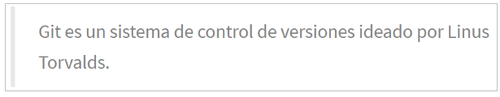
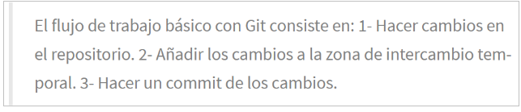
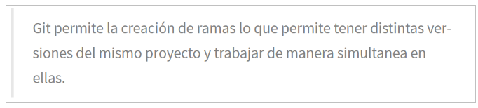

# Ejercicios de manejo del historial de cambios

Para hacer estos ejercicios es necesario haber hecho antes los ejercicios de creación y actualización de repositorios

## Ejercicio 1

1. Mostrar el historial de cambios del repositorio.
2. Crear la carpeta **capitulos** y crear dentro de ella el fichero **capitulo1.txt** con el siguiente texto:

    

3. Git es un sistema de control de versiones ideado por Linus Torvalds.
4. Añadir los cambios a la zona de intercambio temporal.
5. Hacer un commit de los cambios con el mensaje “Añadido capítulo 1.”
6. Volver a mostrar el historial de cambios del repositorio.

~~~
tomas@tomas-VirtualBox:~/Git$ git log
tomas@tomas-VirtualBox:~/Git$ mkdir capitulos
tomas@tomas-VirtualBox:~/Git$ vim capitulo1.txt
Git es un sistema de control de versiones ideado por Linus Torvalds.
tomas@tomas-VirtualBox:~/Git$ git add capitulo1.txt
tomas@tomas-VirtualBox:~/Git$ git commit -m "Añadido capitulo 1"
[master (commit-raíz) 48ec3fb] Añadido capitulo 1
 1 file changed, 1 insertion(+)
 create mode 100644 Git/capitulo1.txt
 tomas@tomas-VirtualBox:~/Git$ git log
commit 48ec3fbe8a8610b7e319a6ad5915b7d77185fd64 (HEAD -> master)
Author: Tomas <tomascastello444@gmail.com>
Date:   Wed Oct 13 08:33:09 2021 +0200

    Añadido capitulo 1 
~~~

## Ejercicio 2

1. Crear el fichero capitulo2.txt en la carpeta capitulos con el siguiente texto.
   
    

1. Añadir los cambios a la zona de intercambio temporal.
2. Hacer un commit de los cambios con el mensaje “Añadido capítulo 2.”
3. Mostrar las diferencias entre la última versión y dos versiones anteriores.

~~~
tomas@tomas-VirtualBox:~/Git/capitulos$ vim capitulo2.txt
tomas@tomas-VirtualBox:~/Git/capitulos$ git add capitulo2.txt
tomas@tomas-VirtualBox:~/Git/capitulos$ git commit -m "Añadido capitulo 2"
[master 1069b2e] Añadido capitulo 2
 1 file changed, 1 insertion(+)
 create mode 100644 Git/capitulos/capitulo2.txt
 tomas@tomas-VirtualBox:~/Git/capitulos$ git diff HEAD~2..HEAD
fatal: argumento ambiguo 'HEAD~2..HEAD': revisión desconocida o ruta fuera del árbol de trabajo.
Use '--' para separar las rutas de las revisiones, de esta manera:
'git <comando> [<revisión>...] -- [<archivo>...]'
~~~

## Ejercicio 3

1. Crear el fichero capitulo3.txt en la carpeta capitulos con el siguiente texto.

       

2. Añadir los cambios a la zona de intercambio temporal.
3. Hacer un commit de los cambios con el mensaje “Añadido capítulo 3.”
4. Mostrar las diferencias entre la primera y la última versión del repositorio.

~~~
tomas@tomas-VirtualBox:~/Git/capitulos$ vim capitulo3.txt
tomas@tomas-VirtualBox:~/Git/capitulos$ git add capitulo3.txt
tomas@tomas-VirtualBox:~/Git/capitulos$ git commit -m "Añadido capitulo 3"
[master d9d5e2f] Añadido capitulo 3
 1 file changed, 1 insertion(+)
 create mode 100644 Git/capitulos/capitulo3.txt
 tomas@tomas-VirtualBox:~/Git/capitulos$ git diff HEAD~1..HEAD
diff --git a/Git/capitulos/capitulo3.txt b/Git/capitulos/capitulo3.txt
new file mode 100644
index 0000000..589038e
--- /dev/null
+++ b/Git/capitulos/capitulo3.txt
@@ -0,0 +1 @@
+t permite la creación de ramas los que permite tener distintas versiones del mismo proyecto y trabajar de manera simultanea en ellas.
~~~

## Ejercicio 4

1. Añadir al final del fichero indice.txt la siguiente línea:

    

2. Añadir los cambios a la zona de intercambio temporal.
3. Hacer un commit de los cambios con el mensaje “Añadido capítulo 5 al índice.”
4. Mostrar quién ha hecho cambios sobre el fichero indice.txt.

~~~
tomas@tomas-VirtualBox:~/Git/capitulos$ vim indice.txt
tomas@tomas-VirtualBox:~/Git/capitulos$ git add indice.txt
tomas@tomas-VirtualBox:~/Git/capitulos$ git commit -m "Añadido capitulo 5 al indice"
[master 4700891] Añadido capitulo 5 al indice
 1 file changed, 1 insertion(+)
 create mode 100644 Git/capitulos/indice.txt
 tomas@tomas-VirtualBox:~/Git/capitulos$ git annotate indice.txt
47008912        (     Tomas     2021-10-13 09:00:49 +0200       1)Capítulo 5:Conceptos avanzados
~~~
