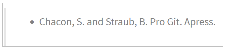
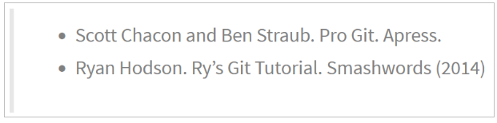
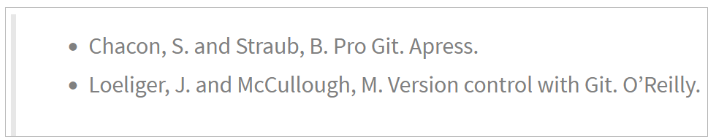
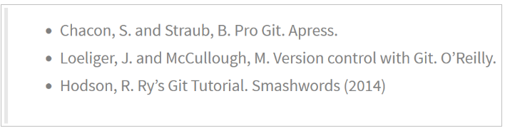

# Ejercicios de gestión de ramas

Para hacer estos ejercicios es necesario haber hecho antes los ejercicios sobre historial de cambios

## Ejercicio 1

Crear una nueva rama **bibliografia** y mostrar las ramas del repositorio.

~~~git
tomas@tomas-VirtualBox:~/Git/libro$ git branch bibliografia

tomas@tomas-VirtualBox:~/Git/libro$ git branch -av
  bibliografia bd06e13 YES
* master       bd06e13 YES

tomas@tomas-VirtualBox:~/Git/libro$ git log --oneline
bd06e13 (HEAD -> master, bibliografia) YES
4d3d982 Añadido capitulo 3 sobre gestion de indice
c67e098 Añadido indice del libro
~~~

## Ejercicio 2

1. Crear el fichero capitulos/capitulo4.txt y añadir el texto siguiente

    

2. Añadir los cambios a la zona de intercambio temporal.
3. Hacer un commit con el mensaje “Añadido capítulo 4.”
4. Mostrar la historia del repositorio incluyendo todas las ramas.

~~~git
tomas@tomas-VirtualBox:~/Git/libro$ vim capitulos/capitulo4.txt

tomas@tomas-VirtualBox:~/Git/libro$ git add .

tomas@tomas-VirtualBox:~/Git/libro$ git commit -m "Añadido capitulo 4."
[master a38b9aa] Añadido capitulo 4.
 1 file changed, 1 insertion(+)
 create mode 100644 capitulos/capitulo4.txt

tomas@tomas-VirtualBox:~/Git/libro$ git log --oneline
a38b9aa (HEAD -> master) Añadido capitulo 4.
bd06e13 (bibliografia) YES
4d3d982 Añadido capitulo 3 sobre gestion de indice
c67e098 Añadido indice del libro
~~~

## Ejercicio 3
    
1. Cambiar a la rama bibliografia.
2. Crear el fichero bibliografia.txt y añadir la siguiente referencia

    

3. Añadir los cambios a la zona de intercambio temporal.
4. Hacer un commit con el mensaje “Añadida primera referencia bibliográfica.”
5. Mostrar la historia del repositorio incluyendo todas las ramas.

~~~git
tomas@tomas-VirtualBox:~/Git/libro$ git checkout bibliografia
Cambiado a rama 'bibliografia'

tomas@tomas-VirtualBox:~/Git/libro$ vim bibliografia.txt

tomas@tomas-VirtualBox:~/Git/libro$ git add .

tomas@tomas-VirtualBox:~/Git/libro$ git commit -m "Añadida primera referencia bibliográfica."
[bibliografia 0cf1521] Añadida primera referencia bibliográfica.
 1 file changed, 1 insertion(+)
 create mode 100644 bibliografia.txt

tomas@tomas-VirtualBox:~/Git/libro$ git log --graph --all --oneline
* 0cf1521 (HEAD -> bibliografia) Añadida primera referencia bibliográfica.
| * a38b9aa (master) Añadido capitulo 4.
|/  
* bd06e13 YES
* 4d3d982 Añadido capitulo 3 sobre gestion de indice
* c67e098 Añadido indice del libro
~~~

## Ejercicio 4

1. Fusionar la rama **bibliografia** con la rama **master**.
2. Mostrar la historia del repositorio incluyendo todas las ramas.
3. Eliminar la rama **bibliografia**.
4. Mostrar de nuevo la historia del repositorio incluyendo todas las ramas.

~~~git
tomas@tomas-VirtualBox:~/Git/libro$ git checkout master
Cambiado a rama 'master'

tomas@tomas-VirtualBox:~/Git/libro$ git merge bibliografia
Merge made by the 'recursive' strategy.
 bibliografia.txt | 1 +
 1 file changed, 1 insertion(+)
 create mode 100644 bibliografia.txt

tomas@tomas-VirtualBox:~/Git/libro$ git log --graph --all --oneline
*   0419a6c (HEAD -> master) Merge branch 'bibliografia'
|\  
| * 0cf1521 (bibliografia) Añadida primera referencia bibliográfica.
* | a38b9aa Añadido capitulo 4.
|/  
* bd06e13 YES
* 4d3d982 Añadido capitulo 3 sobre gestion de indice
* c67e098 Añadido indice del libro

tomas@tomas-VirtualBox:~/Git/libro$ git branch -d bibliografia
Eliminada la rama bibliografia (era 0cf1521)..

tomas@tomas-VirtualBox:~/Git/libro$ git branch -av
* master 0419a6c Merge branch 'bibliografia

tomas@tomas-VirtualBox:~/Git/libro$ git log --graph --all --oneline
*   0419a6c (HEAD -> master) Merge branch 'bibliografia'
|\  
| * 0cf1521 Añadida primera referencia bibliográfica.
* | a38b9aa Añadido capitulo 4.
|/  
* bd06e13 YES
* 4d3d982 Añadido capitulo 3 sobre gestion de indice
* c67e098 Añadido indice del libro
~~~

## Ejercicio 5

1. Crear la rama **bibliografia**.
2. Cambiar a la rama **bibliografia**.
3. Cambiar el fichero **bibliografia.txt** para que contenga las siguientes referencias:

    

4. Añadir los cambios a la zona de intercambio temporal y hacer un commit con el mensaje “Añadida nueva referencia bibliográfica.”
5. Cambiar a la rama *master*.

6. Cambiar el fichero **bibliografia.txt** para que contenga las siguientes referencias:

    

7. Añadir los cambios a la zona de intercambio temporal y hacer un commit con el mensaje “Añadida nueva referencia bibliográfica.”
    
8. Fusionar la rama bibliografia con la rama master.

9.  Resolver el conflicto dejando el fichero bibliografia.txt con las referencias:

    

10.  Añadir los cambios a la zona de intercambio temporal y hacer un commit con el mensaje “Resuelto conflicto de bibliografía.”
11.  Mostrar la historia del repositorio incluyendo todas las ramas.

~~~git
tomas@tomas-VirtualBox:~/Git/libro$ git branch bibliografia

tomas@tomas-VirtualBox:~/Git/libro$ git log --graph --all --oneline
*   0419a6c (HEAD -> master, bibliografia) Merge branch 'bibliografia'
|\  
| * 0cf1521 Añadida primera referencia bibliográfica.
* | a38b9aa Añadido capitulo 4.
|/  
* bd06e13 YES
* 4d3d982 Añadido capitulo 3 sobre gestion de indice
* c67e098 Añadido indice del libro

tomas@tomas-VirtualBox:~/Git/libro$ git checkout bibliografia
Cambiado a rama 'bibliografia'

tomas@tomas-VirtualBox:~/Git/libro$ vim bibliografia.txt

tomas@tomas-VirtualBox:~/Git/libro$ git add .

tomas@tomas-VirtualBox:~/Git/libro$ git commit -m "Añadida nueva referencia bibliográfica."
[bibliografia 3358a51] Añadida nueva referencia bibliográfica.
 1 file changed, 2 insertions(+)

tomas@tomas-VirtualBox:~/Git/libro$ git checkout master
Cambiado a rama 'master'

tomas@tomas-VirtualBox:~/Git/libro$ vim bibliografia.txt

tomas@tomas-VirtualBox:~/Git/libro$ git add .

tomas@tomas-VirtualBox:~/Git/libro$ git commit -m "Añadida nueva referencia bibliográfica."
[master 4aea655] Añadida nueva referencia bibliográfica.
 1 file changed, 1 insertion(+)

tomas@tomas-VirtualBox:~/Git/libro$ git branch -av
  bibliografia 3358a51 Añadida nueva referencia bibliográfica.
* master       4aea655 Añadida nueva referencia bibliográfica.

tomas@tomas-VirtualBox:~/Git/libro$ git merge bibliografia
Auto-fusionando bibliografia.txt
CONFLICTO (contenido): Conflicto de fusión en bibliografia.txt
Fusión automática falló; arregle los conflictos y luego realice un commit con el resultado.

tomas@tomas-VirtualBox:~/Git/libro$ vim bibliografia.txt

tomas@tomas-VirtualBox:~/Git/libro$ git status
En la rama master
Tienes rutas no fusionadas.
  (arregla los conflictos y corre "git commit"
  (usa "git merge --abort" para abortar la fusion)

Rutas no fusionadas:
  (usa "git add <archivo>..." para marcar una resolución)
	ambos modificados:     bibliografia.txt

sin cambios agregados al commit (usa "git add" y/o "git commit -a")

tomas@tomas-VirtualBox:~/Git/libro$ git add .

tomas@tomas-VirtualBoxtomas@tomas-VirtualBox:~/Git/libro$ git commit -m "Resuelto conflicto de bibliografía."
[master ac55d92] Resuelto conflicto de bibliografía.

tomas@tomas-VirtualBox:~/Git/libro$ git log --graph --all --oneline
*   ac55d92 (HEAD -> master) Resuelto conflicto de bibliografía.
|\  
| * 3358a51 (bibliografia) Añadida nueva referencia bibliográfica.
* | 4aea655 Añadida nueva referencia bibliográfica.
|/  
*   0419a6c Merge branch 'bibliografia'
|\  
| * 0cf1521 Añadida primera referencia bibliográfica.
* | a38b9aa Añadido capitulo 4.
|/  
* bd06e13 YES
* 4d3d982 Añadido capitulo 3 sobre gestion de indice
* c67e098 Añadido indice del libro
~~~
