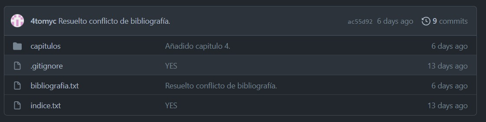
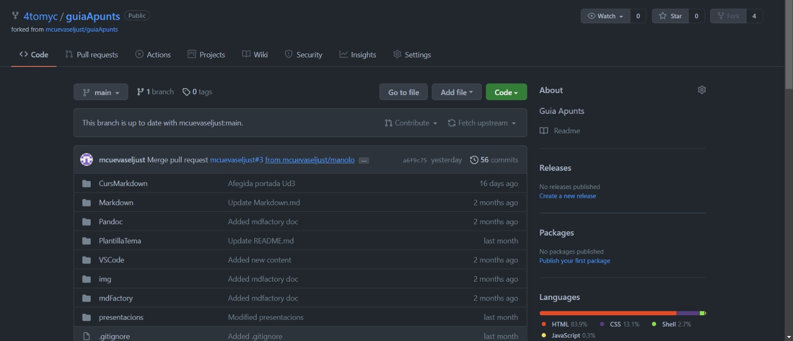
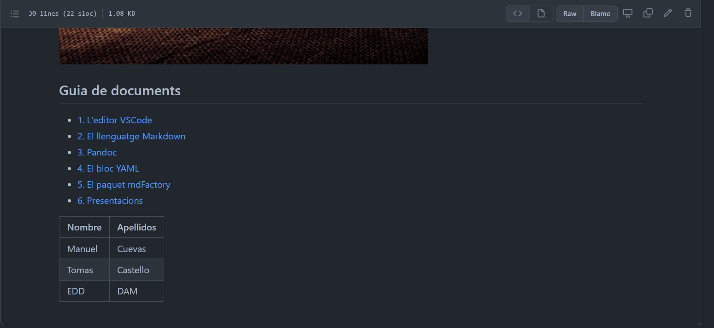
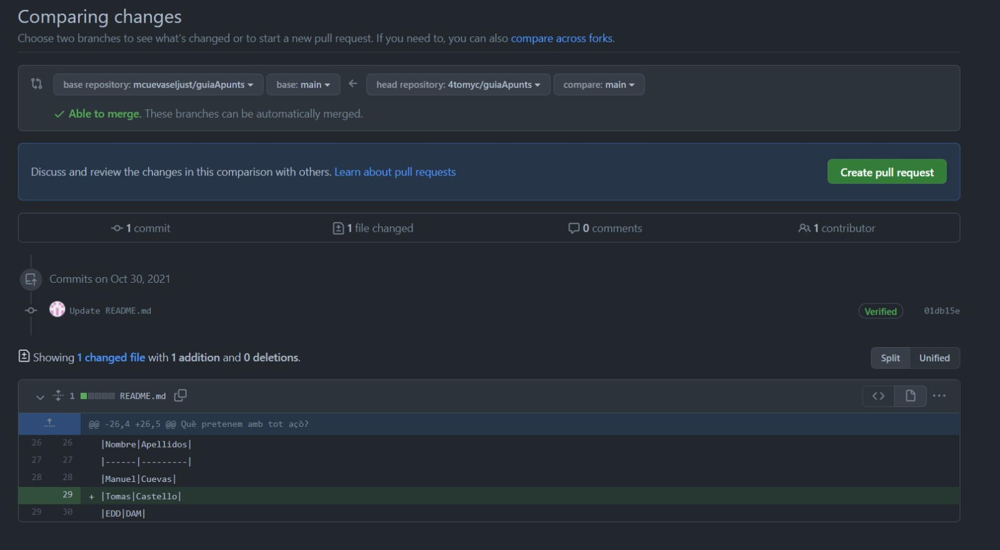
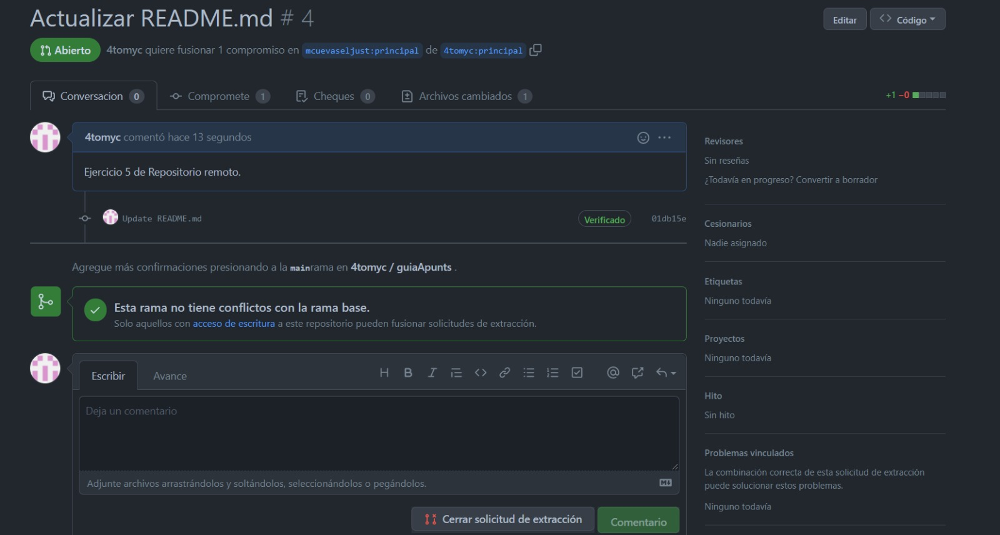
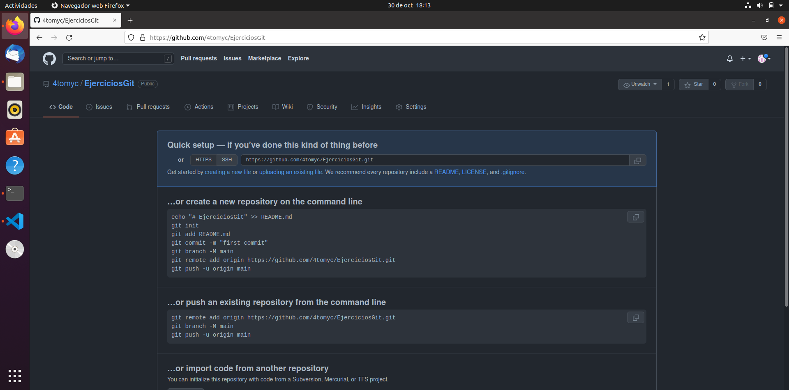
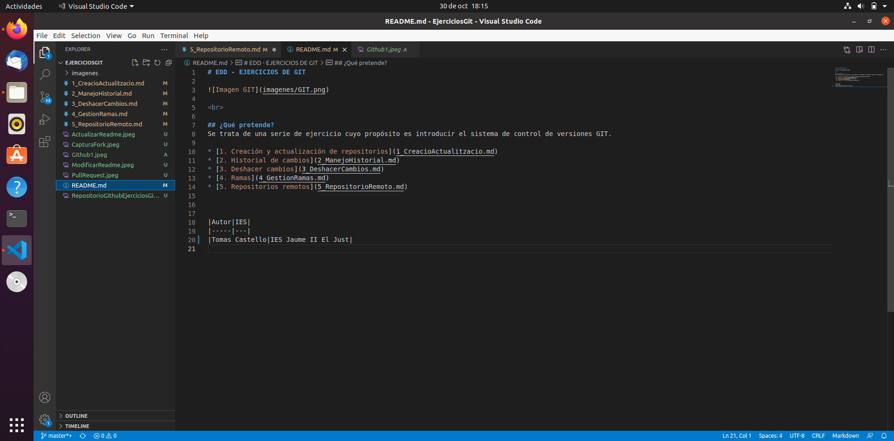

# Ejercicios de repositorios remotos

Para hacer estos ejercicios es necesario haber hecho antes los ejercicios sobre ramas.

## Ejercicio 1

1. Crear un nuevo repositorio público en GitHub con el nombre **libro-git**.
2. Añadirlo al repositorio local del libro.
3. Mostrar todos los repositorios remotos configurados.

~~~git
4tomyc / libro-git
tomas@tomas-VirtualBox:~/Git/libro$ git remote add github https://github.com/4tomyc/libro-git.git
tomas@tomas-VirtualBox:~/Git/libro$ git remote -v
github	https://github.com/4tomyc/libro-git.git (fetch)
github	https://github.com/4tomyc/libro-git.git (push)
~~~

## Ejercicio 2

1. Añadir los cambios del repositorio local al repositorio remoto de GitHub.
2. Acceder a GitHub y comprobar que se han subido los cambios mostrando el historial de versiones.

~~~git
tomas@tomas-VirtualBox:~/Git/libro$ git push -u github master
Username for 'https://github.com': 4tomyc
Password for 'https://4tomyc@github.com': 
Enumerando objetos: 34, listo.
Contando objetos: 100% (34/34), listo.
Compresión delta usando hasta 2 hilos
Comprimiendo objetos: 100% (29/29), listo.
Escribiendo objetos: 100% (34/34), 3.05 KiB | 3.05 MiB/s, listo.
Total 34 (delta 11), reusado 0 (delta 0)
remote: Resolving deltas: 100% (11/11), done.
To https://github.com/4tomyc/libro-git.git
 * [new branch]      master -> master
Rama 'master' configurada para hacer seguimiento a la rama remota 'master' de 'github'.
~~~

## Ejercicio 3

1. Colaborar en el repositorio remoto **libro-git** de otro usuario.
2. Clonar su repositorio **libro-git (mcuevaseljust)**.
3. Añadir el fichero **autores.txt** que contenga el nombre del usuario y su correo electrónico.
4. Añadir los cambios a la zona de intercambio temporal.
5. Hacer un commit con el mensaje “Añadido autor.”
6. Subir los cambios al repositorio remoto.

~~~git
tomas@tomas-VirtualBox:~/Git$ git clone https://github.com/mcuevaseljust/libro-git.git
Clonando en 'libro-git'...
remote: Enumerating objects: 41, done.
remote: Counting objects: 100% (41/41), done.
remote: Compressing objects: 100% (30/30), done.
remote: Total 41 (delta 6), reused 41 (delta 6), pack-reused 0
Desempaquetando objetos: 100% (41/41), 4.38 KiB | 299.00 KiB/s, listo.

tomas@tomas-VirtualBox:~/Git$ cd libro-git
tomas@tomas-VirtualBox:~/Git/libro-git$ vim autores.txt

tomas@tomas-VirtualBox:~/Git$ cd libro-git
tomas@tomas-VirtualBox:~/Git/libro-git$ vim autores.txt
tomas@tomas-VirtualBox:~/Git/libro-git$ git add .
tomas@tomas-VirtualBox:~/Git/libro-git$ git commit -m "Añadido autores.txt"
[master 4441506] Añadido autores.txt
 1 file changed, 2 insertions(+)
 create mode 100644 autores.txt

tomas@tomas-VirtualBox:~/Git/libro-git$ git push -f github master
Username for 'https://github.com': 4tomyc
Password for 'https://4tomyc@github.com': 
Enumerando objetos: 44, listo.
Contando objetos: 100% (44/44), listo.
Compresión delta usando hasta 2 hilos
Comprimiendo objetos: 100% (38/38), listo.
Escribiendo objetos: 100% (44/44), 4.66 KiB | 954.00 KiB/s, listo.
Total 44 (delta 7), reusado 0 (delta 0)
remote: Resolving deltas: 100% (7/7), done.
To https://github.com/4tomyc/libro-git.git
 + ac55d92...4441506 master -> master (forced update)
~~~

## Ejercicio 4

1. Desde vuestra cuenta de GitHub, realizad un «Fork» del repositorio https://github.com/mcuevaseljust/guiaApunts.git.
2. Modificad el fichero README.md, añadiendo vuestro nombre en la tabla.
3. Haced un «Pull request» para contribuir en el repositorio de «mcuevaseljust», podéis dejar un comentario.

Nota: En este ejercicio, deberéis enviar capturas de los pasos que vayáis llevando a cabo.

#### Soluciones:

## Ejercicio 5

1. Clonar el repositorio **mcuevaseljust/EjerciciosGit**
2. Crea un repositorio en tu cuenta de GitHub, y sube el repositorio clonado con las soluciones de los diferentes ejercicios.
3. Modifica el fichero README.md, indicando tu nombre e indica la dirección del repositorio.

#### Soluciones

~~~~
tomas@tomas-VirtualBox:~/ejercicio5/EjerciciosGit$ 
~~~~

https://github.com/4tomyc/EjerciciosGit.git
